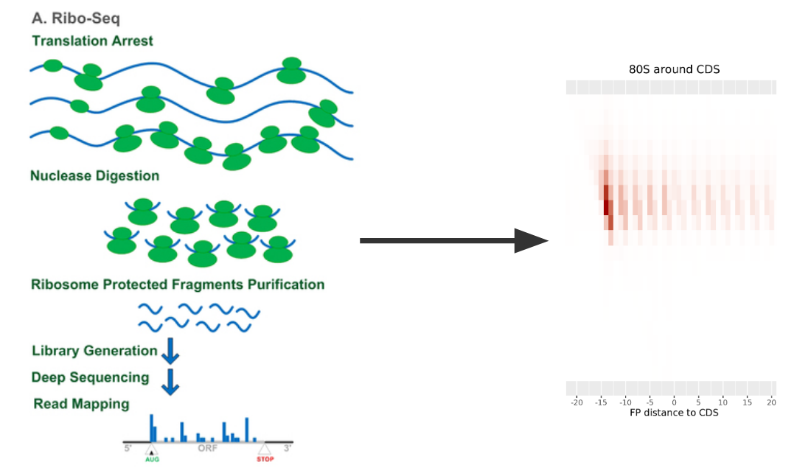

# Ribo seq heatmap 101

AIM: draw a heatmap around coding sequence start with ribo-seq data.

`fastq` => `trimmed fastq` => `sam/bam` => `position + count` => `heatmap`

- raw data: [GSM4154182](https://www.ncbi.nlm.nih.gov/geo/query/acc.cgi?acc=GSM4154182)
- reference method: [Selective footprinting of 40S and 80S ribosome subpopulations (Sel-TCP-seq) to study translation and its control](https://www.nature.com/articles/s41596-022-00708-4)

## Prerequisite

1. Hardware: at least 16GB RAM, 20GB Storage
2. Some programming knowledge. (Linux, R)
